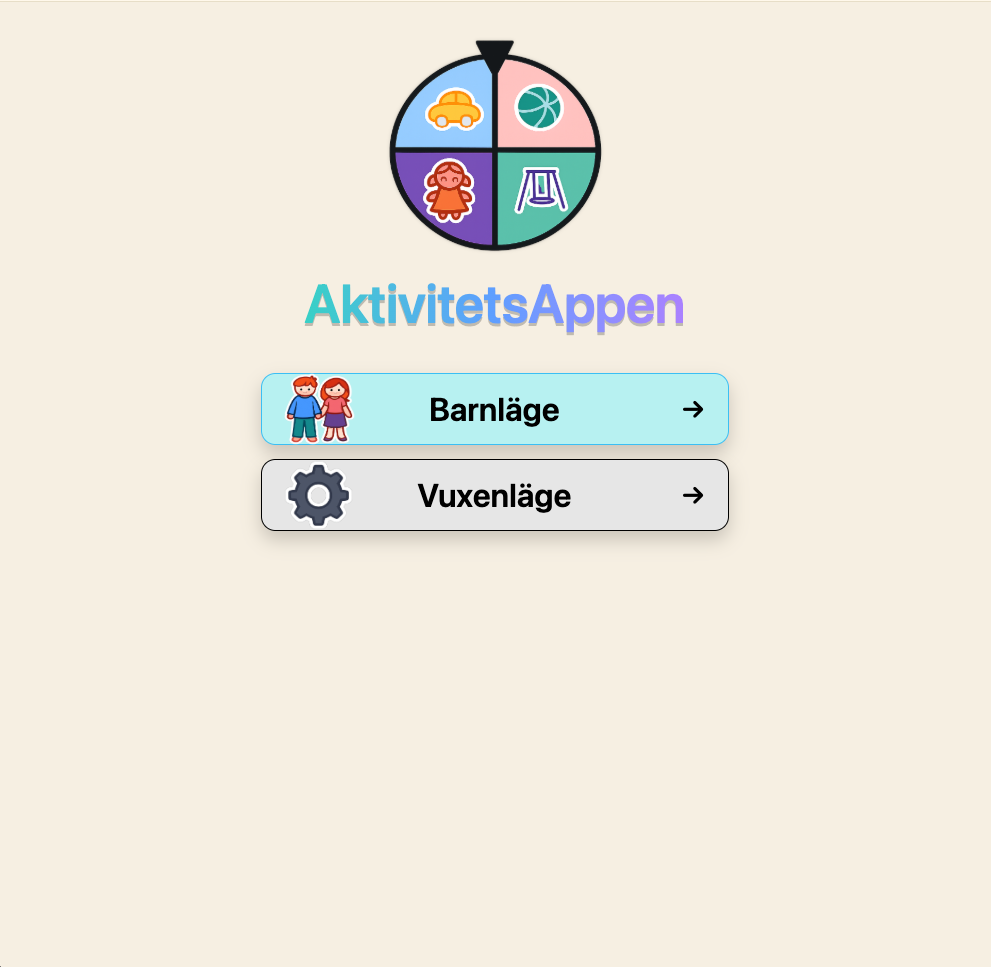
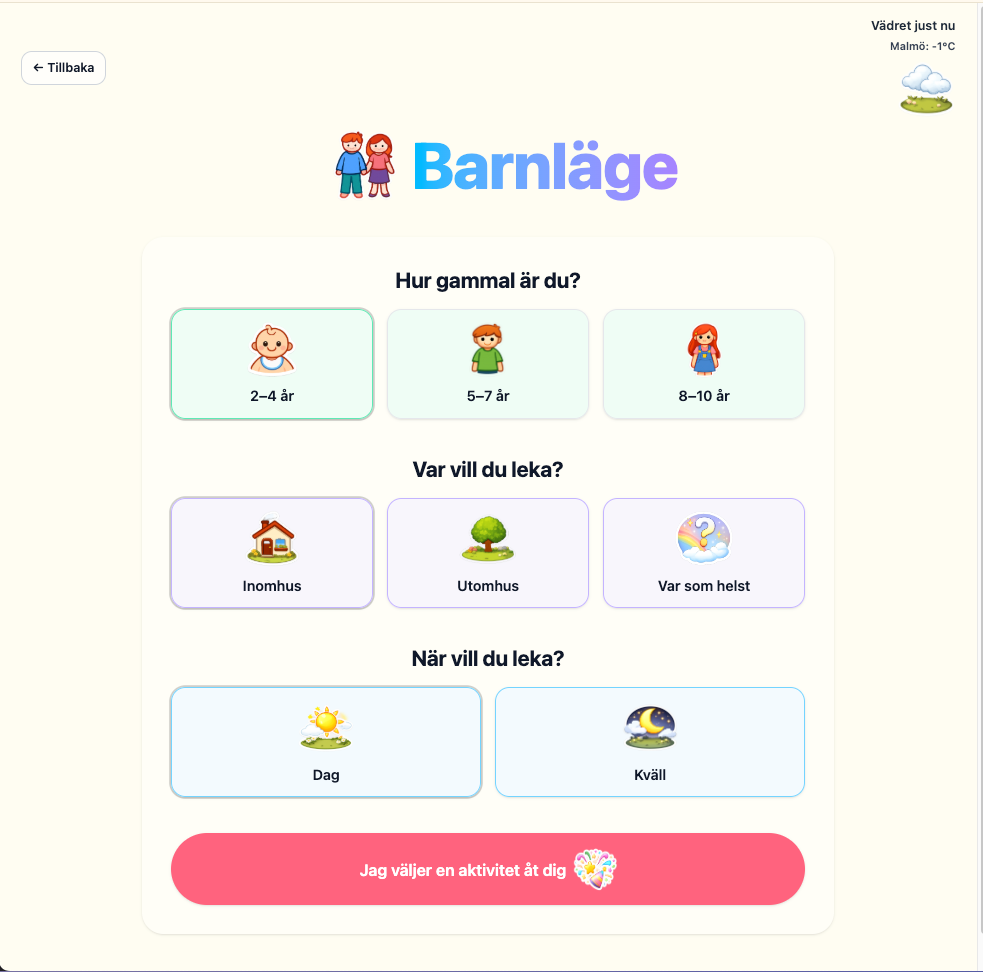
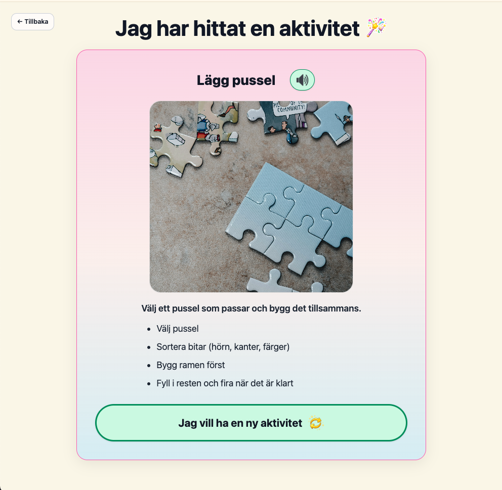
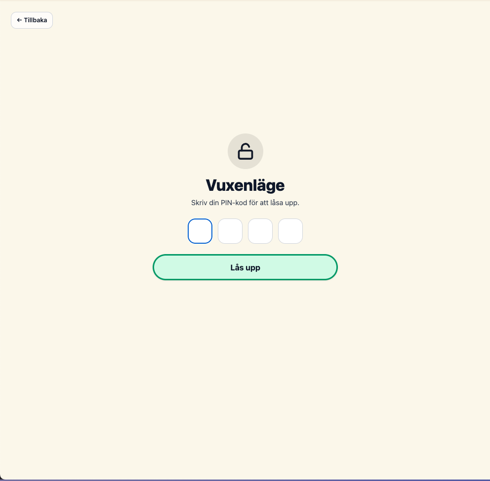
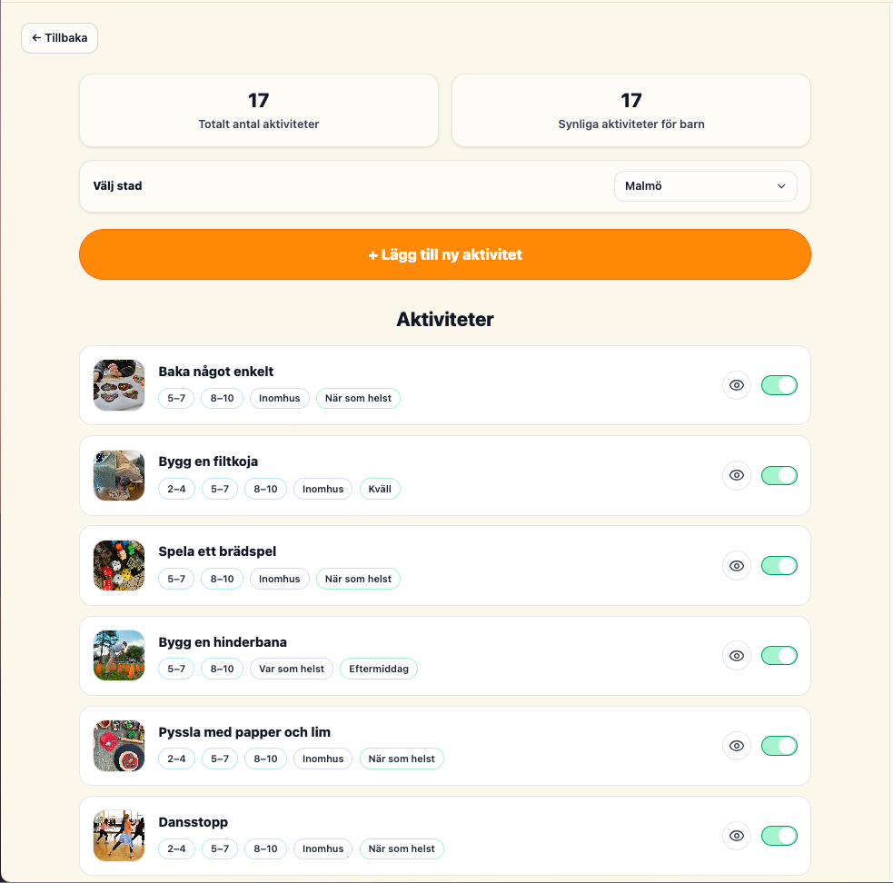

# AktivitetsAppen (Kids Activity App)

🌐 **Live demo:** https://kids-app-psi.vercel.app

AktivitetsAppen is a web application developed as a final degree project in frontend development, built using React, Vite, and Tailwind CSS.

The project was created to support children and parents in everyday life by reducing screen time and instead encouraging creativity, movement, and shared offline activities.

The app addresses this by randomly suggesting age-appropriate activities based on whether the child is indoors or outdoors, the time of day, and the current weather. A separate Parent Mode allows adults to add their own activities and control which activities are visible to the child.

---

## ✨ Overview

The application consists of two main modes:

- **Kids Mode** – a simple, playful flow where children select preferences and get a random activity.
- **Parent Mode** – a PIN-protected area where adults can manage activities, visibility, and settings.

The UI is intentionally calm, friendly, and distraction-free, while the underlying codebase follows a self-documenting structure with clear responsibilities.

---

## 🧒 Kids Mode – User Flow

### 1. Start view
The user chooses between Kids Mode and Parent Mode.



---

### 2. Filter activities
In Kids Mode, the child selects:
- Age group
- Where they want to play (indoors / outdoors / anywhere)
- When they want to play (day / evening)

The current weather is fetched automatically based on the selected city.



---

### 3. Activity suggestion
Based on the selected filters, the app randomly suggests an activity.

Features:
- Clear title and description
- Step-by-step instructions
- Optional image
- Text-to-speech support for accessibility
- Button to get a new activity without changing filters



---

## 🔒 Parent Mode

### 4. PIN-protected access
Parent Mode is protected by a 4-digit PIN stored locally (for demo/school purposes only).

The PIN input supports:
- Keyboard navigation
- Paste handling
- Screen reader labels
- Error feedback



---

### 5. Parent dashboard
In Parent Mode, the parent can:
- See total number of activities
- Control which activities are visible to children
- Select city for weather data
- Access activity management



---

### 6. Add new activity
Parents can add custom activities through a modal form.

The form includes:
- Image upload
- Title and description
- Step-by-step instructions
- Age, place, and time filters

All custom activities are validated and stored in `localStorage`.


---

## 🧠 Technical Focus & Learnings

This project was built with a strong emphasis on:

- **Readable, self-documenting code**  
  Clear naming, intentional folder structure, and minimal but meaningful comments.

- **Clear folder structure**  
  Separation between views, reusable components, hooks, data, and business logic.

- **Accessibility**  
  Keyboard navigation, ARIA labels, screen reader support, and visible focus states.

- **Type safety with TypeScript**  
  Shared types and strict typing to reduce runtime errors.

- **Separation of concerns**  
  UI, logic, data, and routing are handled in clearly defined layers.

### Key technical concepts used

- React with TypeScript
- Vite for fast development and builds
- React Router for client-side navigation
- Custom hooks for data fetching and state logic
- LocalStorage as a persistence layer
- Runtime validation of untrusted data (e.g. localStorage)
- Accessible UI patterns (semantic HTML, focus states, aria-labels)


---

## 📁 Project Structure

The folder structure is intentionally descriptive and self-documenting:

```text
src/
├── assets/        # Images and icons
├── components/    # Reusable UI and feature components
│   ├── layout/
│   ├── parent/
│   └── ui/
├── data/          # Static and base activity data
├── hook/          # Custom React hooks
├── lib/           # Business logic and utilities
├── routes/        # AppRouter and routing logic
├── types/         # Shared TypeScript types
├── views/         # Page-level components
```

---

## ♿ Accessibility

Accessibility has been considered throughout the application:

- All interactive elements are keyboard-accessible
- Clear focus styles for navigation
- ARIA labels where necessary
- Decorative images use empty `alt=""`
- Informative images include meaningful `alt` text
- Text-to-speech support in Kids Mode

---

## 📝 Code Comments & Documentation

- Variables and functions use descriptive names
- Comments are added **only** where logic is non-obvious
- Complex or defensive logic (e.g. localStorage parsing) is documented
- No unnecessary or redundant comments
- No copy-pasted code without understanding

---

## 🚀 Getting Started

### Install dependencies
```bash
npm install        # install dependencies
npm run dev        # start development server
npm run build      # create production build
```

---

## 👩‍💻 Author

**Alexandra Johansen**  
Frontend Developer Student

This project was developed as part of a frontend development course and serves as a practical demonstration of modern React development, accessibility awareness, and UX-focused design decisions.

